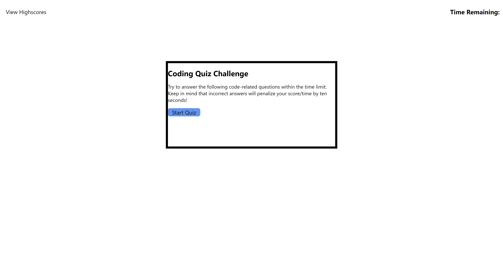

# CodingQuiz-04
## Deployed Website

## GitHub Repository

### Project Summary
This project was to build a coding quiz so that students can test their coding knowledge against their peers. The rules of the game are given on the opening page. The time left over at the end is the user's score for the game.

### Functions of this page that meet the critera:
* When the user clicks on the start button, the timer starts and the first questions is displayed
* When a question is answered, another question appears.
* When either all questions are answered OR the timer reaches 0, the game is over.
* When the game ends, you can save your initials and the score.